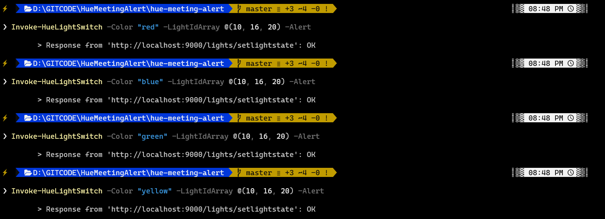

<h1>Local Philips Hue Controls </h1>

<div style="font-size: medium;">Philips Hue + Node Express API + PowerShell Module</div><br/>

- [What is this?](#what-is-this)
  - [Why?](#why)
  - [Stack](#stack)
  - [NPM Dependencies](#npm-dependencies)
  - [API Endpoints](#api-endpoints)
    - [GET](#get)
      - [Authorize App](#authorize-app)
      - [Retrieve Lights List](#retrieve-lights-list)
    - [POST](#post)
      - [Set Light State](#set-light-state)
      - [Set Light State On](#set-light-state-on)
      - [Set Light State Off](#set-light-state-off)
- [Local Express API Install](#local-express-api-install)
  - [Local](#local)
  - [Docker](#docker)
    - [Linux Containers](#linux-containers)
    - [Windows Containers](#windows-containers)
- [PowerShell Module Installation](#powershell-module-installation)
  - [Screenshots](#screenshots)
- [PowerShell Module Usage](#powershell-module-usage)
  - [Get-HueLightsList](#get-huelightslist)
  - [Invoke-HueLightsOn](#invoke-huelightson)
  - [Invoke-HueLightsOff](#invoke-huelightsoff)
  - [Invoke-HueLightSwitch](#invoke-huelightswitch)
- [PowerShell Aliases](#powershell-aliases)

<br/>

# What is this?

A locally-run `Node Express API` application with an accommodating `PowerShell Module` that can be used to control `Philips Hue` lights.

<br/>

## Why? 

Why not? This is a random personal project that I worked on during part of my end-of-year holiday break in 2020.  

I use the `Windows Terminal` a whole lot throughout my regular workday and I thought it would be neat if I could change the color of a `Philips Hue` light (I've got a bunch since I went all in in 2016) from a PowerShell prompt to basically give my family unobtrusive alerts when I'm in a meeting and unavailable.  I wanted access to proper invoke PowerShell functions, but also be able to type `onair` or `offair` to toggle the light whenever I start a call. 

This project was the result. 

> I also started looking into automating the onair/offair commands based on my [presence in Teams](https://docs.microsoft.com/en-us/graph/api/presence-get?view=graph-rest-1.0&tabs=http) - however, that would require me to request special permissions from my organization.  If I were to gain those permissions, that would be completely doable with this setup. 

<br/>

## Stack

I wanted to rock a `Express` node API application because it's a break from `.NET` and seemed like promising stack for what I wanted to achieve. Once I had a working `API` and `PowerShell Module` where I was operating my lights using my shiny new PowerShell functions.

Lots of experimentation 🧪👨‍🔬 

All of this was always meant to be ran locally in `Docker` for portability.  I definitely don't intend to deploy this anywhere publicly.  In my case, I was able to set up a `Raspberry Pi` to run the Docker container and 'remotely' access the API from other devices on my networking using the Pi's local IP address.

There are two parts:

- Locally run `Express`-based `NodeJS` API wrapper application that interacts with the `Philips Hue Remote Hue Developer APIs`.

  - Preferably run on `Docker` (Windows and Linux* flavors available)
- `Windows PowerShell Module` which acts as a wrapper for the `express` API endpoints.

  - Bonus: corresponding set of `PowerShell aliases` to go '**onair**' and '**offair**' from the terminal.

<br/>

## NPM Dependencies

These are the projects that helped build this project quickly. 🚀

- [Express](https://github.com/expressjs/express)
- [node-hue-api](https://github.com/peter-murray/node-hue-api)
- [node-config](https://github.com/lorenwest/node-config)
- [express-mongoose-docs](https://www.npmjs.com/package/express-mongoose-docs)

<br/>

## API Endpoints

### GET

---

#### Authorize App

- `http://localhost:9000/authorize`
  - One time setup, except when tokens expire. 


<br/>

#### Retrieve Lights List

- `http://localhost:9000/lights`
   - List of all connected lights on the Hue bridge.

<br/>

### POST

---

#### Set Light State

- `http://localhost:9000/lights/setlightstate`
  
     - Sets the light state of all inputted device ids.

Params

| Name | Type | Required? | Description |
|---|---|---|---|
| lightids | `Array` of `int`  | ✔ | Target light IDs to send updated light state to.  List can be obtained via `/lights` endpoint |
| colorstate | `string`  | ✔ | Preset `hue` values. Accepts `yellow`, `green`, `blue`, `pink`, or `red` |
| hue | `int`  | ✔ | Hue `int` value (max value: `65535`)  |
| saturation | `int`  | - | Saturation `int` value (max value: `100`)  |
| brightness | `int`  | - | Brightness `int` value (max value: `100`)  |
| alert | `bool`  | - | Short blink when transitioning light state. |
| onstate | `bool`  | - | Flag to set the light ON state. (default `onstate`: true) Use `/lights/setlightstate/on` and `/lights/setlightstate/off` instead.  |

<br/>

> The request requires `colorstate` **OR** `hue` to be present, but **not both**.  If both are present, the response will result in a `400 Bad Request` status.

<br/>

**Request JSON Body Examples**
- Set light `20` to preset color `blue`.
  ```json
  {"colorstate": "blue", "lightids" : [20]}
  ```

- Set lights `16` and `20` to preset color `green`.
  ```json
  {"colorstate": "green", "lightids" : [16, 20], "brightness": 50}
  ```

- Set lights `16` and `20` to preset color `pink` with `50%` brightness and `100%` saturation.
  ```json
  {"colorstate": "pink", "lightids" : [16, 20], "brightness": 50, "saturation": 100}
  ```

- Set lights `16` to preset color `red` and blink during transition.
  ```json
  {"colorstate": "red", "lightids" : [16], "alert": true}
  ```

<br/>

#### Set Light State On

- `http://localhost:9000/lights/setlightstate/on`

     - Sets the light state of all inputted device ids to **on** state.

<br/>

#### Set Light State Off
- `http://localhost:9000/lights/setlightstate/off`

     - Sets the light state of all inputted device ids to **off** state.

<br/><br/>

# Local Express API Install

The express API can run locally with npm installed or in Docker.  I use Docker to keep it running in the background so I can interact with it whenever I'd like. 

## Local

- `node -v` 11 and above

**Required**

- Run `npm install`

- Run `node index.js`

- Run `npm install apidoc -g`

**Optional**

- `npm install forever -g`

<br/>

## Docker

There two `Dockerfiles` to support the `Express API` running in either `Windows Containers` or `Linux Containers`.  
- `Linux Containers` are preferred for this stack, but if you intend to have the `Docker` container running while using `Windows Containers`, the `Dockerfile` for `Windows` is also available. 

### Linux Containers

Depends on [Official Docker Images for node](https://hub.docker.com/_/node )

  ```ps
  docker pull node
  ```

1. Switch to Linux Containers in Docker

2. Build the image  against `Dockerfile.Linux`
   ```ps
    docker build --pull --rm -f "local-hue-controls\hue-express-node-api\Dockerfile.Linux" -t hue-express-node-api "local-hue-controls\hue-express-node-api" 
   ```

3. Run the image `docker run --rm -d  -p 9000:9000/tcp hue-for-powershell:latest`

<br/>

### Windows Containers

The `Dockerfile.Windows` is a modified version of [stefanscherer/node-windows](https://hub.docker.com/r/stefanscherer/node-windows)

1. Switch to `Windows Containers`

2. Build the image 
    - In VS Code, right-click on `Dockerfile.Windows` and give the build a name/tag, and hit enter. 

    Or run

    ```ps
    docker build --pull --rm -f "hue-for-powershell\Dockerfile" -t hue-for-powershell:latest "hue-for-powershell"` against `Dockerfile.Windows`
    ```

3. Run the image 
    ```ps
    docker run --rm -d  -p 9000:9000/tcp windows-hue-node:latest`
    ```

> Using `Windows Containers` for this project requires `npm install` to have ran locally since the `node_modules` is copied to the container when the image is built.

<br/><br/>

# PowerShell Module Installation

1. Copy the `hue-for-powershell` folder into to a location to a valid `PSModulePath` path registered
   - Run `$Env:PSModulePath` to find one.

2. Run `Import-Module hue-for-powershell`

3. Run `Get-HueLightsList` to see if everything is working.


<br/>

## Screenshots
  > 

  > 
  
<br/><br/>

# PowerShell Module Usage

## Get-HueLightsList
|  |  |
|---|---|
Synopsis | Gets the list of registered lights from the Hue Bridge. 
Description | This function will call the /lights endpoint of the application. 
Examples | Get-HueLightsList 
|       | Get-HueLightsList -OutGridView
|       | Get-HueLightsList  - ExcludeUnreachable

<br/><br/>

## Invoke-HueLightsOn

|  |  |
|---|---|
| Synopsis | Invokes an ON light state action against a series of lights based on of the device ID.
| Description | Calls the `/lights/setlightstate/on` API endpoint. 
| Example | Invoke-HueLightsOn -LightIdArray @(1) 
|         | Invoke-HueLightsOn -LightIdArray @(2, 6)
|         | Invoke-HueLightsOn -LightIdArray @(2, 6. 12)

<br/><br/>

## Invoke-HueLightsOff

|  |  |
|---|---|
| Synopsis | Invokes an OFF light state action against a series of lights based on of the device ID.
| Description | Calls the `/lights/setlightstate/off` API endpoint. 
| Example | Invoke-HueLightsOff -LightIdArray @(1) 
|         | Invoke-HueLightsOff -LightIdArray @(2, 6)
|         | Invoke-HueLightsOff -LightIdArray @(2, 6. 12)

<br/><br/>

## Invoke-HueLightSwitch

|  |  |
|---|---|
| Synopsis | Invokes an updated light state action against a series of lights based on the device ID.
| Description | Calls the `/lights/setlightstate` API endpoint. 

<br/>

```ps
Invoke-HueLightSwitch -LightIdArray @(int, int, int) `
                      -Color "default" `
                      -Hue 65535 `
                      -Saturation 100 `
                      -Brightness 50 `
                      -Alert
```
<br/>

|Color | Sample |
|---|---|
|  Green      | **Invoke-HueLightSwitch** `-LightIdArray` *$array* `-Color` *"green"* `-Alert`
|  Blue      | **Invoke-HueLightSwitch** `-LightIdArray` *$array* `-Color` *"blue"* `-Alert`
|  Red      | **Invoke-HueLightSwitch** `-LightIdArray` *$array* `-Color` *"red"* `-Alert` 
|  Pink      | **Invoke-HueLightSwitch** `-LightIdArray` *$array* `-Color` *"pink"* `-Alert`
|  Yellow      | **Invoke-HueLightSwitch** `-LightIdArray` *$array* `-Color` *"yellow"* `-Alert`


<br/>

# PowerShell Aliases

Run `onair` or `offair` to trigger 3 lights.
- `onair` turns the lights to red
- `offair` turns them to a neutral soft white 

 Edit your PowerShell profile (run `> code $profile`)

 Paste the following and modify the `LightIdArray`.
```ps
Set-Alias onair Invoke-OnAirLights
function Invoke-OnAirLights {  
    [CmdletBinding()]
    param([Parameter(Position=0)]
    [string]$Query
  )
	Invoke-HueLightSwitch -LightIdArray @(7, 20) -Color "red" -Alert
}

Set-Alias offair Invoke-OffAirLights
function Invoke-OffAirLights {  
    [CmdletBinding()]
    param([Parameter(Position=0)]
    [string]$Query
  )

	Invoke-HueLightSwitch -LightIdArray @(7, 20) -Color "default" -Alert
}

```